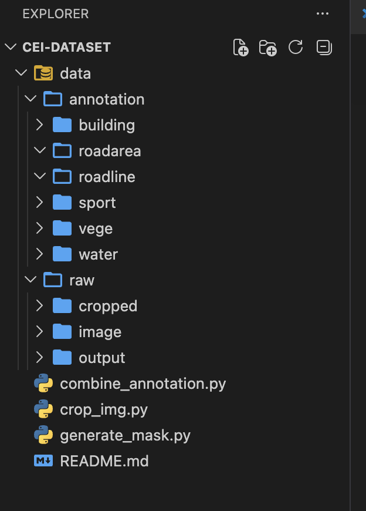

# CEI-Dataset Instructions

## 1. Cropping Images

Run the following command to crop all images into 1024x1024 tiles (with a 250px left margin):

```sh
python3 crop_img.py
```

- Cropped images will be saved in the `data/raw/cropped/` directory.
- The script automatically processes all images in `data/raw/image/`.

## 2. Labeling

- There are 195 images to label.
- After labeling, save each GeoJSON file using the following naming convention:
	- For buildings: `b_geojson_0001.geojson`
	- For sports: `s_geojson_0001.geojson`
	- For vegetation: `v_geojson_0001.geojson`
	- For road lines: `rl_geojson_0001.geojson`
	- etc.
- Place each GeoJSON file in its corresponding subdirectory under `data/annotation/` (e.g., `data/annotation/building/`).

- **Labeling guidelines:** Follow the instructions in the [label technique document](https://docs.google.com/document/d/1iKMLfSWxGtZCozzISkt_GM6rlkliU8h-G4-rDuNDHtQ/edit?tab=t.0#heading=h.pmfk1e8gy3rb).

## 3. Combining Annotations

After labeling, run:

```sh
python3 combine_annotation.py
```

- This script combines all category annotations (building, road, sport, vege, water) for each image into a single GeoJSON file per image.
- Output is saved in a combined annotations directory (the script may need to be updated to match your folder structure).

## 4. Generating Mask Images

After combining annotations, run:

```sh
python3 generate_mask.py
```

- This script generates mask images from the combined annotation files.
- Output masks are saved in the appropriate directory (the script may need to be updated to match your folder structure).


## Folder 

---

**Note:**
- Make sure your directory structure and file naming match what the scripts expect.
- If you need the scripts to match a different folder or naming convention, let me know and I can help update them.